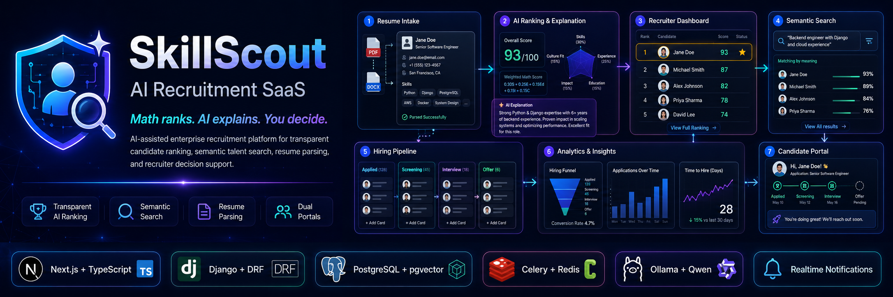

<p align="center">
  
</p>

---

## Overview

SkillScout is a recruitment and applicant-tracking system (ATS) that helps organizations
move candidates through hiring pipelines and supports every decision with explainable AI.
Deterministic scoring drives the ranking; a locally hosted language model only **explains**
the result, so outcomes stay reproducible, auditable, and free of per-request API cost.

The platform is multi-tenant: each organization manages its own jobs, candidates, and team
members under role-based access control, behind secure JWT authentication.

## Key Features

- **Multi-tenant organizations** with role-based access control across four roles —
  Administrator, Recruiter, Hiring Manager, and Interviewer.
- **Secure authentication** using JSON Web Tokens stored in HTTP-only cookies.
- **End-to-end hiring workflows** — job posting, candidate application tracking, resume and
  document management, and pipeline stage management.
- **AI candidate evaluation** — automated resume parsing, semantic candidate–job matching,
  and hybrid scoring, with concise, LLM-generated recruiter insights.
- **Zero API cost AI** — language-model features run on a locally hosted model via Ollama.
- **Asynchronous processing** with Celery and Redis for parsing, embedding, and scoring jobs.
- **Production tooling** — Docker, GitHub Actions CI/CD, and automated testing.

## Architecture

```
Candidate / Recruiter
        |
        v
Next.js + TypeScript frontend  ──►  Django REST API (JWT, RBAC)
                                          |
                  ┌───────────────────────┼────────────────────────┐
                  v                        v                        v
            PostgreSQL              Celery + Redis            AI pipeline
           (Supabase)            (async tasks)        resume parsing · semantic
                                                      matching · hybrid scoring ·
                                                      LLM insights (Ollama, local)
```

**Design principle — "Math decides, AI explains":** a deterministic scoring model produces
the ranking and the numbers; the language model is used only to articulate *why*, never to
make the decision. This keeps results consistent and defensible.

## Tech Stack

| Layer | Technology |
|-------|-----------|
| Frontend | Next.js, TypeScript, Tailwind CSS, shadcn/ui |
| Backend | Django, Django REST Framework, SimpleJWT |
| Database | PostgreSQL (Supabase-managed in production) |
| Authentication | JWT with HTTP-only cookies |
| Task queue | Celery, Redis |
| AI / LLM | Ollama (local LLM), embedding-based semantic search, hybrid scoring |
| Testing | Playwright, pytest |
| DevOps | Docker, GitHub Actions (CI/CD); deployed on Railway and Vercel |

## Getting Started

### Prerequisites

- Docker and Docker Compose
- (For local LLM features) Ollama installed and running

### 1. Configure environment variables

```bash
cp .env.example .env
cp backend/.env.example backend/.env
cp frontend/.env.example frontend/.env.local
```

Generate a Django secret key and set `DJANGO_SECRET_KEY` in `.env`:

```bash
python -c "import secrets; print(secrets.token_urlsafe(50))"
```

### 2. Run with Docker (recommended)

```bash
docker compose up --build
docker compose exec django python manage.py migrate
```

### 3. Or run the services locally

**Backend**

```bash
cd backend
python -m venv .venv && source .venv/bin/activate   # Windows: .\.venv\Scripts\Activate.ps1
pip install -r requirements.txt
python manage.py migrate
python manage.py runserver
```

**Frontend**

```bash
cd frontend
npm install
npm run dev
```

## Service URLs

| Service | URL |
|---------|-----|
| Frontend | http://localhost:3000 |
| Backend API | http://localhost:8000/api/v1/ |
| Health check | http://localhost:8000/api/v1/health/ |
| Django admin | http://localhost:8000/admin/ |

## Project Structure

```
backend/         Django API — apps, config, migrations
frontend/        Next.js — app router, components, types
supabase/        Supabase local development config
infrastructure/  Docker and deployment support
```

## License

Released under the [MIT License](LICENSE).

## Author

**Parthiv A M** — Full Stack Developer (Python, Django, React, Next.js) with a focus on AI/LLM integration.
[GitHub](https://github.com/Paaarthiv) · [LinkedIn](https://www.linkedin.com/in/parthivam)

## License

Released under the [MIT License](LICENSE) © Parthiv A M.
