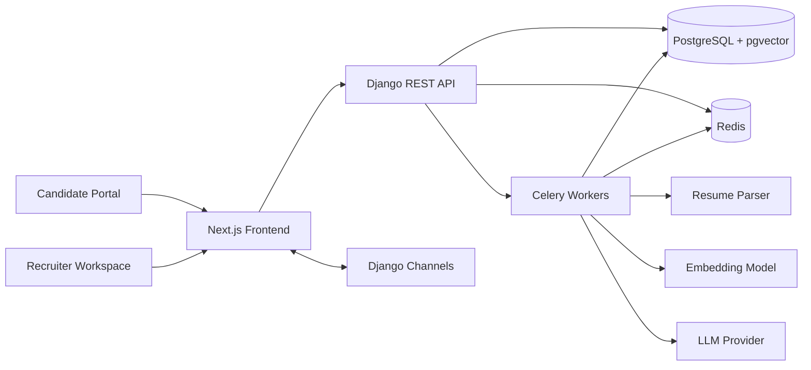

<p align="center">
  
</p>

# SkillScout - AI Recruitment SaaS

> Math ranks. AI explains. Humans decide.

<p align="center">
  <a href="https://github.com/Paaarthiv/AI-recruitment-SaaS/actions/workflows/ci.yml">
    
  </a>
  
  
  
  
  
  
</p>

SkillScout is a full-stack, AI-assisted recruitment platform for modern hiring teams. It helps recruiters create jobs, ingest resumes, rank applicants with transparent scoring, search candidates semantically, and generate role-specific interview preparation while keeping the final hiring decision with a human reviewer.

The product includes two connected experiences:

- **Recruiter workspace** for jobs, candidates, applications, pipeline stages, semantic search, batch screening, analytics, notifications, and settings.
- **Candidate portal** for job discovery, applications, verification, and application status tracking.

## Live Demo

| Surface | URL |
| --- | --- |
| Application | [skillscout-parthiv-a-ms-projects.vercel.app](https://skillscout-parthiv-a-ms-projects.vercel.app) |
| Backend API | [ai-recruitment-saas-production.up.railway.app](https://ai-recruitment-saas-production.up.railway.app) |
| API Docs | [Swagger/OpenAPI](https://ai-recruitment-saas-production.up.railway.app/api/docs/) |

Production currently runs the frontend on **Vercel** and the Django API, Celery worker, Redis, PostgreSQL, and pgvector stack on **Railway**.

## Core Capabilities

| Area | What SkillScout provides |
| --- | --- |
| Candidate ranking | Hybrid scoring across semantic fit, skills, experience, and job requirements. |
| AI explanations | LLM-generated summaries that explain score drivers, strengths, gaps, and next-step recommendations. |
| Resume intelligence | PDF/DOCX parsing into structured candidate profiles, experience timelines, education, and skill data. |
| Semantic search | pgvector-backed candidate search using `BAAI/bge-small-en-v1.5` embeddings. |
| Batch screening | Background processing for large resume uploads with Celery and Redis. |
| Hiring pipeline | Drag-and-drop pipeline stages for tracking candidates through the recruiting process. |
| Interview prep | AI-generated interview questions and preparation material tailored to a candidate and role. |
| Analytics | Funnel metrics, pipeline health, time-to-hire, and operational recruiting dashboards. |
| Notifications | Real-time and persisted notifications through Django Channels and Redis. |
| Multi-tenant foundation | Organization-scoped users, jobs, candidates, and applications. |

## Product Principles

- **AI assists; humans decide.** AI output is advisory context, not an automated rejection or hiring decision.
- **Transparent ranking.** Deterministic scoring produces the rank; the LLM explains the result in plain language.
- **Recruiter control.** The workflow is designed for review, comparison, notes, and pipeline movement by a human team.
- **Privacy-aware architecture.** Resume processing, auth cookies, service-role keys, and tenant boundaries are handled with production security patterns.

## Tech Stack

| Layer | Technology |
| --- | --- |
| Frontend | Next.js App Router, React 18, TypeScript, Tailwind CSS, shadcn/ui-style components |
| Backend | Django 5.2, Django REST Framework, SimpleJWT, drf-spectacular |
| Realtime | Django Channels, Daphne, channels-redis |
| Database | PostgreSQL with pgvector |
| Async work | Celery, Redis |
| AI / ML | Ollama-compatible LLMs, sentence-transformers, `BAAI/bge-small-en-v1.5` |
| Resume parsing | pdfplumber, python-docx |
| Auth | JWT with HTTP-only cookies, CORS/CSRF configuration |
| Quality | Pytest, Ruff, ESLint, TypeScript, Prettier, pre-commit |
| Deployment | Vercel, Railway, Docker, GitHub Actions |

## Architecture



### Backend Modules

| App | Responsibility |
| --- | --- |
| `accounts` | Users, authentication, JWT cookie flows, email verification |
| `organizations` | Multi-tenant organizations and membership |
| `jobs` | Job postings, requirements, and job lifecycle |
| `candidates` | Candidate profiles, resumes, applications, and notes |
| `ai_engine` | Embeddings, ranking, semantic search, AI insights |
| `interviews` | AI-generated interview prep and questions |
| `pipeline` | Hiring stages and candidate movement |
| `batch` | Bulk upload and background screening |
| `analytics` | Recruiting metrics and dashboards |
| `notifications` | Real-time and persisted notifications |
| `core` | Shared utilities, health checks, base models |

### Frontend Areas

| Route group | Purpose |
| --- | --- |
| `(dashboard)` | Recruiter application: jobs, candidates, applications, pipeline, search, batch, analytics, settings |
| `(candidate)` | Candidate dashboard and application tracking |
| `(public)` | Login, registration, public jobs, and verification flows |

## Repository Layout

```text
backend/          Django API, domain apps, Celery tasks, settings, tests
frontend/         Next.js app, route groups, UI components, hooks, types
supabase/         Supabase local development configuration
infrastructure/   Docker and deployment support
docs/             Deployment documentation
raw/              Human-managed product, architecture, and research documents
wiki/             LLM-maintained project knowledge base
```

## Getting Started

### Prerequisites

- Python 3.12
- Node.js 22
- Docker and Docker Compose
- PostgreSQL with pgvector and Redis, if running services outside Docker
- Optional: Ollama or an Ollama-compatible hosted endpoint for AI features

### 1. Clone the repository

```bash
git clone https://github.com/Paaarthiv/AI-recruitment-SaaS.git
cd AI-recruitment-SaaS
```

### 2. Configure environment variables

```bash
cp .env.example .env
cp backend/.env.example backend/.env
cp frontend/.env.example frontend/.env.local
```

Generate a local Django secret key and set `DJANGO_SECRET_KEY` in your environment files:

```bash
python -c "import secrets; print(secrets.token_urlsafe(50))"
```

AI features require these variables to point to a working model provider:

```text
OLLAMA_BASE_URL=http://localhost:11434
LLM_MODEL=qwen3-coder:480b
LLM_FALLBACK_MODELS=gemma3:12b,gemma3:4b
EMBEDDING_MODEL=BAAI/bge-small-en-v1.5
EMBEDDING_PROVIDER=sentence_transformers
```

### 3. Run with Docker

```bash
docker compose up --build
docker compose exec django python manage.py migrate
```

### 4. Open the local services

| Service | URL |
| --- | --- |
| Frontend | [http://localhost:3000](http://localhost:3000) |
| Backend API | [http://localhost:8000/api/v1/](http://localhost:8000/api/v1/) |
| API docs | [http://localhost:8000/api/docs/](http://localhost:8000/api/docs/) |
| Health check | [http://localhost:8000/api/v1/health/](http://localhost:8000/api/v1/health/) |
| Django admin | [http://localhost:8000/admin/](http://localhost:8000/admin/) |

## Local Development

### Backend

```bash
cd backend
python -m venv .venv
source .venv/bin/activate
pip install -r requirements.txt
python manage.py migrate
python manage.py runserver
```

For Windows PowerShell:

```powershell
cd backend
python -m venv .venv
.\.venv\Scripts\Activate.ps1
pip install -r requirements.txt
python manage.py migrate
python manage.py runserver
```

### Frontend

```bash
cd frontend
npm install
npm run dev
```

## Quality Checks

Run these before opening a pull request or deploying a change.

### Backend

```bash
cd backend
ruff check .
ruff format .
pytest
python manage.py check
```

### Frontend

```bash
cd frontend
npm run lint
npm run type-check
npm run format
```

### Pre-commit

```bash
pre-commit install
pre-commit run --all-files
```

## Documentation

| Topic | Document |
| --- | --- |
| Deployment | [docs/DEPLOYMENT.md](docs/DEPLOYMENT.md) |
| System overview | [raw/architecture/system-overview.md](raw/architecture/system-overview.md) |
| Backend architecture | [raw/architecture/backend-architecture.md](raw/architecture/backend-architecture.md) |
| Frontend architecture | [raw/architecture/frontend-architecture.md](raw/architecture/frontend-architecture.md) |
| Environment variables | [raw/architecture/environment-variables.md](raw/architecture/environment-variables.md) |
| Authentication strategy | [raw/architecture/cookie-auth-strategy.md](raw/architecture/cookie-auth-strategy.md) |
| API design | [raw/apis/api-design.md](raw/apis/api-design.md) |
| Architecture decisions | [raw/decisions](raw/decisions) |

## Deployment

The production deployment is split by runtime responsibility:

- **Vercel** hosts the Next.js frontend.
- **Railway** hosts the Django ASGI API, Celery worker, PostgreSQL, and Redis.
- **Supabase Storage** stores resume files and related candidate assets where configured.
- **Ollama-compatible model provider** powers LLM summaries and embedding-related workflows.

See [docs/DEPLOYMENT.md](docs/DEPLOYMENT.md) for the full deployment checklist, environment variables, Railway service setup, Vercel setup, and cross-site cookie configuration.

## Security and Responsible AI

SkillScout is designed for assistive hiring workflows. Candidate ranking and summaries should be reviewed by trained recruiters and hiring teams before any action is taken.

Key safeguards in the architecture:

- HTTP-only JWT cookies with CORS and CSRF controls.
- Server-only handling for Supabase service-role credentials.
- Organization-scoped data boundaries.
- Deterministic scoring separated from LLM-generated explanation.
- AI recommendations presented as review context, not final hiring decisions.

## Roadmap

- Expand evaluation coverage for ranking, parsing, and AI-generated interview content.
- Add richer audit trails around AI-assisted recommendations.
- Improve observability for Celery tasks, model latency, and parsing failures.
- Harden production tenant isolation and admin workflows.
- Add more candidate communication and scheduling integrations.

## Contributing

Contributions are welcome through issues and pull requests. For larger changes, open an issue first with the problem statement, proposed approach, and expected impact.

Recommended workflow:

1. Create a focused branch.
2. Keep changes scoped to one feature or fix.
3. Add or update tests when behavior changes.
4. Run backend and frontend quality checks.
5. Open a pull request with screenshots or API examples when relevant.

## License

Released under the [MIT License](LICENSE). Copyright (c) Parthiv A M.
